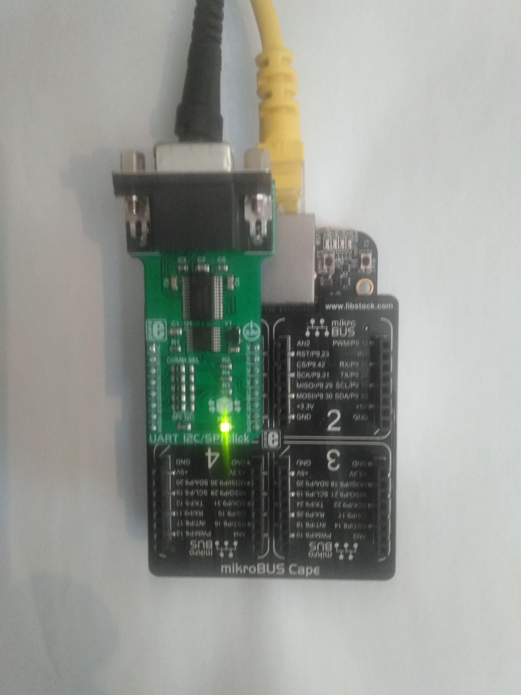

## BBB Debian Buster Environment Setup

### WARNING: The BBB board revision used is 0x0A5C! Thus BBB board 0x000C should be obtained!
### People are highly encouraged to use overlays in .../BBB-debian_buster/overlay_examples/

### Explored Embedded HW Configuration:




### U-boot 04.2019 Overlays

The mandatory reading to understand U-boot 04.2019 overlays and environment
setup is posted here:

BeagleBone Black

https://www.digikey.com/eewiki/display/linuxonarm/BeagleBone+Black

Please, read this link very carefully!

#### Bootloader: U-Boot

Das U-Boot – the Universal Boot Loader: http://www.denx.de/wiki/U-Boot

eewiki.net patch archive: https://github.com/eewiki/u-boot-patches

Download U-Boot:

	user@localhost:~$
	git clone https://github.com/u-boot/u-boot
	cd u-boot/
	git checkout v2019.04 -b tmp

U-Boot Patches:

	user@localhost:~/u-boot$
	wget -c https://github.com/eewiki/u-boot-patches/raw/master/v2019.04/0001-am335x_evm-uEnv.txt-bootz-n-fixes.patch
	wget -c https://github.com/eewiki/u-boot-patches/raw/master/v2019.04/0002-U-Boot-BeagleBone-Cape-Manager.patch
  
	patch -p1 < 0001-am335x_evm-uEnv.txt-bootz-n-fixes.patch
	patch -p1 < 0002-U-Boot-BeagleBone-Cape-Manager.patch

Configure and Build:

	user@localhost:~/u-boot$
	make ARCH=arm CROSS_COMPILE=${CC} distclean
	make ARCH=arm CROSS_COMPILE=${CC} am335x_evm_defconfig
	make ARCH=arm CROSS_COMPILE=${CC}

#### Optional Reading

U-Boot Overlays:

https://elinux.org/Beagleboard:BeagleBoneBlack_Debian#U-Boot_Overlays

BeagleBone uboot transplantation:

http://www.programmersought.com/article/19361176463/

### Supported Linux Kernels out of the box:

#### Pre-built kernels: (there are multiple options avaiable)

	$ cd /opt/scripts/tools/
	$ git pull
	$ sudo ./update_kernel.sh ## update to the latest kernel, supporting bb-overlays
	$ sudo reboot

#### Supported Linux Kernels: v4.19.x

v4.19.x-ti:

	# /opt/scripts/tools/update_kernel.sh --lts-4_19 --ti-channel

v4.19.x-ti + Real Time:

	# /opt/scripts/tools/update_kernel.sh --lts-4_19 --ti-rt-channel

v4.19.x mainline:

	# /opt/scripts/tools/update_kernel.sh --lts-4_19 --bone-channel

v4.19.x mainline + Real Time:

	# /opt/scripts/tools/update_kernel.sh --lts-4_19 --bone-rt-channel

#### Supported Linux Kernels: v5.4.24

	# /opt/scripts/tools/update_kernel.sh --lts-5-4.24

#### Tested Versions of dtc:

	v1.4.4
	v1.4.6
	v1.4.7
	v1.5.0
	v1.5.1

Known Broken: v1.4.5 (DO NOT USE)

### Building a Custom BB-kernel
https://github.com/RobertCNelson/bb-kernel

Current development is found under branches.

Example: https://github.com/RobertCNelson/bb-kernel/tree/am33x-v4.19

Execute the following to build the custom menuconfig:

	host$ git clone https://github.com/RobertCNelson/bb-kernel.git
	host$ cd bb-kernel
	host$ git remote show origin
	host$ git checkout am33x-v4.19
	host$ ./build_kernel.sh

Here are the custom changes for menuconfig, to be done in order to have proper kernel for the example:

https://github.com/ZoranStojsavljevic/MikroE_BeagleBone-Black-BSP_Integration/blob/master/BBB-debian_buster/overlay_examples/KERNEL.md

https://github.com/ZoranStojsavljevic/MikroE_BeagleBone-Black-BSP_Integration/blob/master/BBB-debian_buster/overlay_examples/i2c2_sc16is740/MIKROE-3349/README.md

### U-Boot Generic uEnv.txt file used (example overlays commented out by default)

https://github.com/ZoranStojsavljevic/MikroE_BeagleBone-Black-BSP_Integration/blob/master/BBB-debian_buster/overlay_examples/uEnv.txt

### BBB P9 header I2C2 Overlay (BB-I2C2-00A0.dts file)

	$ cat BB-I2C2-00A0.dts

	/*
	 * Virtual cape for I2C2 on connector pins P9.12 P9.19 P9.20
	 *
	 * This program is free software; you can redistribute it and/or modify
	 * it under the terms of the GNU General Public License version 2 as
	 * published by the Free Software Foundation.
	 */

	/dts-v1/;
	/plugin/;

	/ {
		compatible = "ti,beaglebone", "ti,beaglebone-black", "ti,beaglebone-green";

		// identification
		part-number = "BB-I2C2";
		version = "00A0";

		// resources this cape uses
		exclusive-use =
			"P9.19",	// i2c2_sda
			"P9.20",	// i2c2_scl
			"i2c2";		// hardware ip used

		/*
		 * Helper to show loaded overlays under: /proc/device-tree/chosen/overlays/
		 */
		fragment@0 {
			target-path="/";
			__overlay__ {

				chosen {
					overlays {
						BB-I2C2-00A0 = "Thu Mar 12 19:35:36 2020";
					};
				};
			};
		};

		/*
		 * Free up the pins used by the cape from the pinmux helpers.
		 */
		fragment@1 {
			target = <&ocp>;
			__overlay__ {
				P9_19_pinmux { status = "disabled"; };	/* i2c2_scl */
				P9_20_pinmux { status = "disabled"; };	/* i2c2_sda */
			};
		};

		fragment@2 {
			target = <&am33xx_pinmux>;
			__overlay__ {
				bb_i2c2_pins: pinmux_bb_i2c2_pins {
					pinctrl-single,pins = <
						0x17c 0x73	/* i2c2_sda, SLEWCTRL_SLOW | INPUT_PULLUP | MODE3 */
						0x178 0x73	/* i2c2_scl, SLEWCTRL_SLOW | INPUT_PULLUP | MODE3 */
					>;
					linux,phandle = <0x00000001>;
					phandle = <0x00000001>;
				};
			};
		};

		fragment@3 {
			target = <&i2c2>;
			__overlay__ {
				status = "okay";
				pinctrl-names = "default";
				pinctrl-0 = <&bb_i2c2_pins>;

				/* this is the configuration part */
				clock-frequency = <100000>;

				#address-cells = <1>;
				#size-cells = <0>;

				/* add any i2c devices on the bus here */
			};
		};
	};

After importing this overlay, the following is an outcome on the target BBB platform:

	# i2cdetect -r 2

	WARNING! This program can confuse your I2C bus, cause data loss and worse!
	I will probe file /dev/i2c-2 using receive byte commands.
	I will probe address range 0x03-0x77.
	Continue? [Y/n] y
	     0  1  2  3  4  5  6  7  8  9  a  b  c  d  e  f
	00:          -- -- -- -- -- -- -- -- -- -- -- -- -- 
	10: -- -- -- -- -- -- -- -- -- -- -- -- -- -- -- -- 
	20: -- -- -- -- -- -- -- -- -- -- -- -- -- -- -- -- 
	30: -- -- -- -- -- -- -- -- -- -- -- -- -- -- -- -- 
	40: -- -- -- -- -- -- -- -- -- 49 -- -- -- -- -- -- 
	50: 50 51 52 53 UU UU UU UU -- -- -- -- -- -- -- -- 
	60: -- -- -- -- -- -- -- -- -- -- -- -- -- -- -- -- 
	70: -- -- -- -- -- -- -- -- 

### BB-SC16IS740 Silicon Overlay

	$ cat BB-SC16IS740-00A0.dts
```
/*
 * SPDX-License-Identifier: GPL-2.0-only
 *
 * Description taken from the following pointer:
 * sc16is7xx uart i2c kernel module problems #2241
 * https://github.com/raspberrypi/linux/issues/2241
 *
 * Example taken (and adapted for NXP sc16is740 silicon) from the following pointer:
 * https://github.com/Ysurac/raspberry_kernel_mptcp/blob/master/arch/arm/boot/dts/overlays/sc16is750-i2c-overlay.dts
 */

/dts-v1/;
/plugin/;

/ {
	compatible = "ti,beaglebone", "ti,beaglebone-black";

	// identification
	part-number = "BB-SC16IS740";
	version = "00A0";

	/*
	 * Helper to show loaded overlays under: /proc/device-tree/chosen/overlays/
	 */
	fragment@0 {
		target-path="/";
		__overlay__ {

			chosen {
				overlays {
					BB-SC16IS740-00A0 = "Thu Mar 12 19:35:36 2020";
				};
			};
		};
	};

	fragment@1 {
		target = <&i2c2>;
		__overlay__ {
			#address-cells = <1>;
			#size-cells = <0>;
			status = "okay";

			sc16is740: sc16is740@49 {
				compatible = "nxp,sc16is740";
				reg = <0x49>; /* address */
				clocks = <&sc16is740_clk>;
				interrupt-parent = <&gpio>;
				interrupts = <48 2>; /* IRQ_TYPE_EDGE_FALLING */
				#gpio-cells = <2>;

				sc16is740_clk: sc16is740_clk {
					compatible = "fixed-clock";
					#clock-cells = <0>;
					clock-frequency = <1843200>;
				};
			};
		};
	};

	__overrides__ {
		int_pin = <&sc16is740>,"interrupts:0";
		addr = <&sc16is740>,"reg:0";
		xtal = <&sc16is740>,"clock-frequency:0";
	};
};
```

### Reading Loaded Overlays

The loaded overlays could be found in the following directory: /proc/device-tree/chosen/overlays/ :

	root@arm:/home/debian# ls -al /proc/device-tree/chosen/overlays/
	total 0
	drwxr-xr-x 2 root root  0 Apr 20 04:50 .
	drwxr-xr-x 3 root root  0 Apr 20 04:50 ..
	-r--r--r-- 1 root root 25 Apr 20 04:50 BB-I2C2-00A0
	-r--r--r-- 1 root root 25 Apr 20 04:50 BB-SC16IS740-00A0
	-r--r--r-- 1 root root  9 Apr 20 04:50 name

### Problem Statement

The Problem Statement is given in the following file: Problem_Statement.md !
