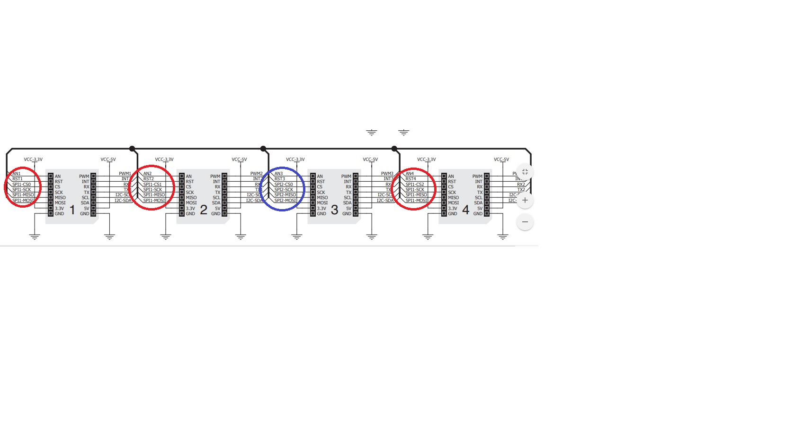

### BBB MikroBus CAPE4

Please, do note the following schematics of BBB MikroBus Cape4:

Number of SPIs represented on this image is assymetric, so with the red circles there
are 3 SPI1 shown (1st, 2nd and 4th slots, with different CSs), and with the blue ONLY
one SPI2 (SPI0) shown (3rd slot).

Please, do note that position of MicroBuses are dependant of which SPIX is actually used!

### To Be Done

DTS overlay yet to be developed. This task is of low priority!
