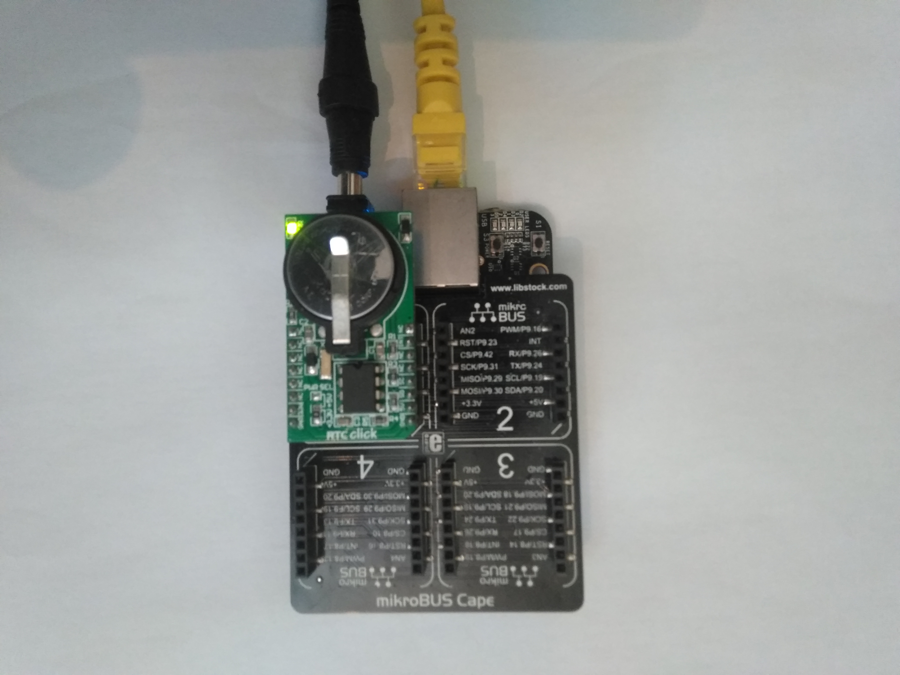

## RTC-CLICK
https://www.mikroe.com/rtc-click

### Explored Embedded HW Configuration:

### Overlay Hierarchy

#### BBB DTS i2c2 Original Segment

From the file in .../arch/arm/boot/dts/am335x-bone-common.dtsi

	&i2c2 {
		pinctrl-names = "default";
		pinctrl-0 = <&i2c2_pins>;

		status = "okay";
		clock-frequency = <100000>;

		cape_eeprom0: cape_eeprom0@54 {
			compatible = "atmel,24c256";
			reg = <0x54>;
			#address-cells = <1>;
			#size-cells = <1>;
			cape0_data: cape_data@0 {
				reg = <0 0x100>;
			};
		};

		cape_eeprom1: cape_eeprom1@55 {
			compatible = "atmel,24c256";
			reg = <0x55>;
			#address-cells = <1>;
			#size-cells = <1>;
			cape1_data: cape_data@0 {
				reg = <0 0x100>;
			};
		};

		cape_eeprom2: cape_eeprom2@56 {
			compatible = "atmel,24c256";
			reg = <0x56>;
			#address-cells = <1>;
			#size-cells = <1>;
			cape2_data: cape_data@0 {
				reg = <0 0x100>;
			};
		};

		cape_eeprom3: cape_eeprom3@57 {
			compatible = "atmel,24c256";
			reg = <0x57>;
			#address-cells = <1>;
			#size-cells = <1>;
			cape3_data: cape_data@0 {
				reg = <0 0x100>;
			};
		};
	};

#### BB-I2C2-00A0 Overlay

	/*
	 * Virtual cape for I2C2 on connector pins P9.19 P9.20
	 *
	 * This program is free software; you can redistribute it and/or modify
	 * it under the terms of the GNU General Public License version 2 as
	 * published by the Free Software Foundation.
	 */

	/dts-v1/;
	/plugin/;

	/ {
		compatible = "ti,beaglebone", "ti,beaglebone-black", "ti,beaglebone-green";

		// identification
		part-number = "BB-I2C2";
		version = "00A0";

		// resources this cape uses
		exclusive-use =
			"P9.19",	// i2c2_sda
			"P9.20",	// i2c2_scl
			"i2c2";		// hardware ip used

		/*
		 * Helper to show loaded overlays under: /proc/device-tree/chosen/overlays/
		 */
		fragment@0 {
			target-path="/";
			__overlay__ {

				chosen {
					overlays {
						BB-I2C2-00A0 = "Thu Mar 12 19:35:36 2020";
					};
				};
			};
		};

		/*
		 * Free up the pins used by the cape from the pinmux helpers.
		 */
		fragment@1 {
			target = <&ocp>;
			__overlay__ {
				P9_19_pinmux { status = "disabled"; };	/* i2c2_scl */
				P9_20_pinmux { status = "disabled"; };	/* i2c2_sda */
			};
		};

		fragment@2 {
			target = <&am33xx_pinmux>;
			__overlay__ {
				bb_i2c2_pins: pinmux_bb_i2c2_pins {
					pinctrl-single,pins = <
						0x17c 0x73	/* i2c2_sda, SLEWCTRL_SLOW | INPUT_PULLUP | MODE3 */
						0x178 0x73	/* i2c2_scl, SLEWCTRL_SLOW | INPUT_PULLUP | MODE3 */
					>;
					linux,phandle = <0x00000001>;
					phandle = <0x00000001>;
				};
			};
		};

		fragment@3 {
			target = <&i2c2>;
			__overlay__ {
				status = "okay";
				pinctrl-names = "default";
				pinctrl-0 = <&bb_i2c2_pins>;

				/* this is the configuration part */
				clock-frequency = <100000>;

				#address-cells = <1>;
				#size-cells = <0>;

				/* add any i2c devices on the bus here */
			};
		};
	};

#### RTC-click Overlay
https://github.com/beagleboard/bb.org-overlays/blob/master/src/arm/PB-I2C2-RTC-CLICK.dts

	/*
	 * Copyright (C) 2017 Robert Nelson <robertcnelson@gmail.com>
	 *
	 * This program is free software; you can redistribute it and/or modify
	 * it under the terms of the GNU General Public License version 2 as
	 * published by the Free Software Foundation.
	 */
	/dts-v1/;
	/plugin/;

	// #include <dt-bindings/board/am335x-bbw-bbb-base.h>
	// #include <dt-bindings/gpio/gpio.h>
	// #include <dt-bindings/pinctrl/am33xx.h>

	/ {
		/*
		 * Helper to show loaded overlays under: /proc/device-tree/chosen/overlays/
		 */
		fragment@0 {
			target-path="/";
			__overlay__ {

				chosen {
					overlays {
						PB-I2C2-RTC-CLICK = "Thu Mar 12 19:35:36 2020";
					};
				};
			};
		};

		fragment@1 {
			target-path="/";
			__overlay__ {

				aliases {
					rtc0 = &extrtc;
					rtc1 = "/ocp/rtc@44e3e000";
				};
			};
		};

		fragment@2 {
			target = <&i2c2>;
			__overlay__ {
				status = "okay";

				#address-cells = <1>;
				#size-cells = <0>;

				extrtc: pcf8583@50 {
					compatible = "nxp,pcf8583";
					reg = <0x50>;
				};
			};
		};
	};

#### Combined BB-I2C2-00A0 and PB-I2C2-RTC-CLICK Overlays
https://github.com/ZoranStojsavljevic/MikroE_BeagleBone-Black-BSP_Integration/blob/master/BBB-debian_buster/overlay_examples/i2c2_pcf8583/BB-I2C2-PCF8523-00A0.dts

	/*
	 * Copyright (C) 2017 Robert Nelson <robertcnelson@gmail.com>
	 *
	 * This program is free software; you can redistribute it and/or modify
	 * it under the terms of the GNU General Public License version 2 as
	 * published by the Free Software Foundation.
	 */

	/dts-v1/;
	/plugin/;

	// #include <dt-bindings/board/am335x-bbw-bbb-base.h>
	// #include <dt-bindings/pinctrl/am33xx.h>
	// #include <dt-bindings/gpio/gpio.h>

	/ {
		compatible = "ti,beaglebone", "ti,beaglebone-black", "ti,beaglebone-green";

		// identification
		part-number = "BB-I2C2-PCF8523";
		version = "00A0";

		// resources this cape uses
		exclusive-use =
			"P9.19",	// i2c2_sda
			"P9.20",	// i2c2_scl

			"i2c2";		// hardware ip used

		/*
		 * Helper to show loaded overlays under: /proc/device-tree/chosen/overlays/
		 */
		fragment@0 {
			target-path="/";
			__overlay__ {

				chosen {
					overlays {
						BB-I2C2-PCF8523-00A0 = "Mon Mar 30 19:35:36 2020";
					};
				};
			};
		};

		/*
		 * Free up the pins used by the cape from the pinmux helpers.
		 */
		fragment@1 {
			target = <&ocp>;
			__overlay__ {
				P9_19_pinmux { status = "disabled"; };	/* i2c2_scl */
				P9_20_pinmux { status = "disabled"; };	/* i2c2_sda */
			};
		};

		fragment@2 {
			target-path="/";
			__overlay__ {
				aliases {
					rtc0 = &extrtc;
					rtc1 = "/ocp/rtc@44e3e000";
				};
			};
		};

		fragment@3 {
			target = <&am33xx_pinmux>;
			__overlay__ {
				bb_i2c2_pins: pinmux_bb_i2c2_pins {
					pinctrl-single,pins = <
						// BONE_P9_20 0x73	/* i2c2_sda, SLEWCTRL_SLOW | INPUT_PULLUP | MODE3 */
						// BONE_P9_19 0x73	/* i2c2_scl, SLEWCTRL_SLOW | INPUT_PULLUP | MODE3 */
						0x17c 0x73	/* i2c2_sda, SLEWCTRL_SLOW | INPUT_PULLUP | MODE3 */
						0x178 0x73	/* i2c2_scl, SLEWCTRL_SLOW | INPUT_PULLUP | MODE3 */
					>;
				};
			};
		};

		fragment@4 {
			target = <&i2c2>;
			__overlay__ {
				status = "okay";
				pinctrl-names = "default";
				pinctrl-0 = <&bb_i2c2_pins>;

				/* this is the configuration part */
				clock-frequency = <100000>;

				#address-cells = <1>;
				#size-cells = <0>;

				extrtc: pcf8523@50 {
					compatible = "nxp,pcf8523";
					reg = <0x50>;
				};
			};
		};
	};

### BBB Debian Buster Kernel

Kernel used for this test:

	root@arm:/lib/firmware# uname -r
	5.4.24-bone20
	root@arm:/lib/firmware# uname -a
	Linux arm 5.4.24-bone20 #1 PREEMPT Tue Mar 17 04:58:24 CET 2020 armv7l GNU/Linux
	root@arm:/lib/firmware# uname -r
	5.4.24-bone20

### User Space Debug Traces

#### I2Cdetect Tool

Slot, dedicated for the RTC CLICK:

Slot 0x50, as seen from the following probe!

	root@arm:/home/debian# i2cdetect -r 2
	WARNING! This program can confuse your I2C bus, cause data loss and worse!
	I will probe file /dev/i2c-2 using receive byte commands.
	I will probe address range 0x03-0x77.
	Continue? [Y/n] y
	     0  1  2  3  4  5  6  7  8  9  a  b  c  d  e  f
	00:          -- -- -- -- -- -- -- -- -- -- -- -- -- 
	10: -- -- -- -- -- -- -- -- -- -- -- -- -- -- -- -- 
	20: -- -- -- -- -- -- -- -- -- -- -- -- -- -- -- -- 
	30: -- -- -- -- -- -- -- -- -- -- -- -- -- -- -- -- 
	40: -- -- -- -- -- -- -- -- -- -- -- -- -- -- -- -- 
	50: UU 51 52 53 UU UU UU UU -- -- -- -- -- -- -- -- 
	60: -- -- -- -- -- -- -- -- -- -- -- -- -- -- -- -- 
	70: -- -- -- -- -- -- -- --                         

#### Directory /dev Traces

After loading both overlays, the following is true!

	# ls -al /dev/rt*

	lrwxrwxrwx 1 root root      4 Apr 15 08:06 /dev/rtc -> rtc0
	crw------- 1 root root 252, 0 Apr 15 08:06 /dev/rtc0
	crw------- 1 root root 252, 1 Apr 15 08:06 /dev/rtc1 <<========== New RTC CLICK clock!

### Changing DEFAULT RTC Device

Please, read /etc/default/hwclock file to set default RTC /dev/rtc0 to RTC /dev/rtc1

	# Defaults for the hwclock init script.  See hwclock(5) and hwclock(8).

	# This is used to specify that the hardware clock incapable of storing
	# years outside the range of 1994-1999.  Set to yes if the hardware is
	# broken or no if working correctly.
	#BADYEAR=no

	# Set this to yes if it is possible to access the hardware clock,
	# or no if it is not.
	#HWCLOCKACCESS=yes

	# Set this to any options you might need to give to hwclock, such
	# as machine hardware clock type for Alphas.
	#HWCLOCKPARS=

	# Set this to the hardware clock device you want to use, it should
	# probably match the CONFIG_RTC_HCTOSYS_DEVICE kernel config option.
	#HCTOSYS_DEVICE=rtc0

[1] According to the reading from this file, kernel MUST be recompiled with the following
.config option:

root@arm:/boot# cat config-5.4.24-bone20 | grep CONFIG_RTC_HCTOSYS_DEVICE

	CONFIG_RTC_HCTOSYS_DEVICE="rtc1"

[2] In the /etc/default/hwclock the option HCTOSYS_DEVICE should be set to rtc1:

	HCTOSYS_DEVICE=rtc1

[3] To use user space RTC Linux commands, please, see hwclock(5) and hwclock(8).
