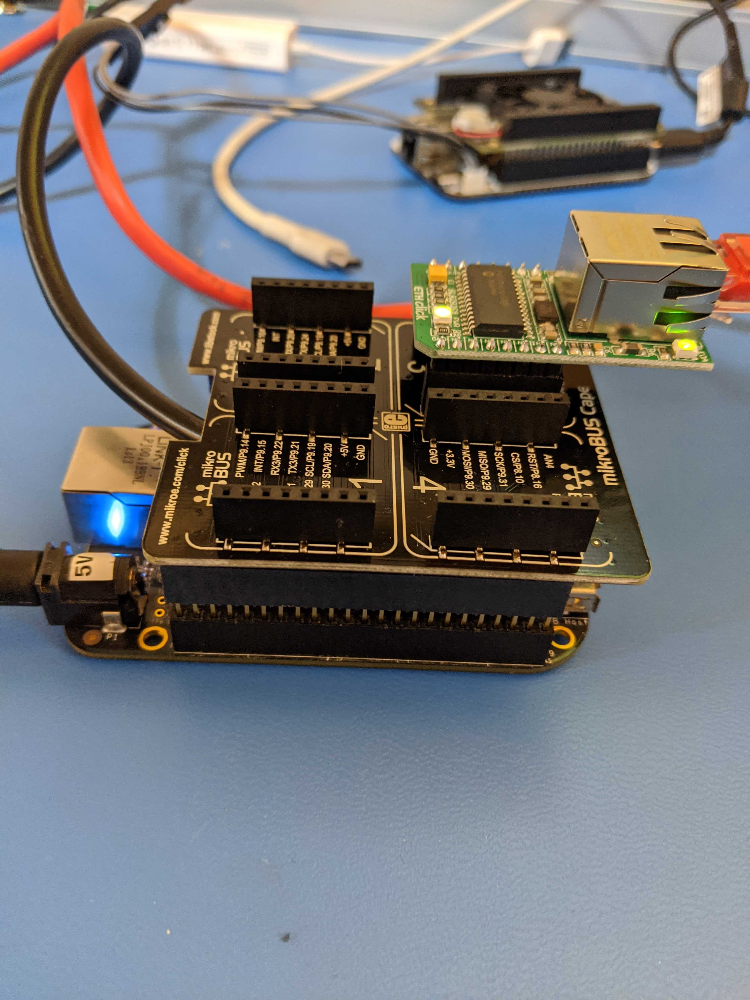
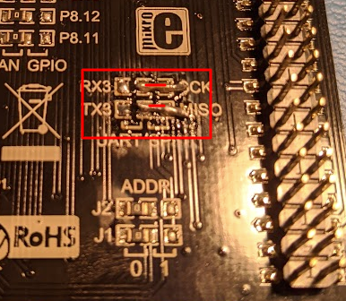

## ETH-CLICK
https://www.mikroe.com/eth-click

Please, do note the following schematics of BBB MikroBus Cape4:


Number of SPIs represented on this image is assymetric, so with the red circles there
are 3 SPI1 shown (1st, 2nd and 4th slots, with different CSs), and with the blue ONLY
one SPI2 (SPI0) shown (3rd slot).

Since SPI0 is used, MikroBus 3 must be used (MikroBus 3 is the only one using SPI0).

### Explored Embedded HW Configuration:



CLICK's HW scheme is shown here:

https://download.mikroe.com/documents/add-on-boards/click/eth/eth-click-manual-v100.pdf

### Cape4 Rework, which is necessary for MikroBus 3 to work with silicon enc28j60

Please, make sure to change the UART3 jumpers/0 Ohm resistors to SPI0 Mode:



### Overlay used for the HW configuration
```
/*
 * Copyright (C) 2018 Robert Nelson <robertcnelson@gmail.com>
 *
 * This program is free software; you can redistribute it and/or modify
 * it under the terms of the GNU General Public License version 2 as
 * published by the Free Software Foundation.
 *
 * https://www.mikroe.com/eth-click
 * https://download.mikroe.com/documents/add-on-boards/click/eth/eth-click-manual-v100.pdf
 ^ https://github.com/RobertCNelson/bb.org-overlays/blob/master/src/arm/BB-mBC3-ETH-CLICK.dts
 *
 * Make sure to change the UART3 jumpers to SPI0 Mode...
 */

/dts-v1/;
/plugin/;

#include <dt-bindings/gpio/gpio.h>
#include <dt-bindings/pinctrl/am33xx.h>
#include <dt-bindings/interrupt-controller/irq.h>

/ {
	compatible = "ti,beaglebone", "ti,beaglebone-black", "ti,beaglebone-green";

	/* identification */
	part-number = "BB-mBC3-ETH-CLICK";
	// version = "00A0";

	/* state the resources this cape uses */
	exclusive-use =
		/* the pin header uses */
		"P9.17",	/* P9_17 (A16) spi0_cs0.spi0_cs0 */
		"P9.18",	/* P9_18 (B16) spi0_d1.spi0_d1 */
		"P9.21",	/* P9_21 (B17) spi0_d0.spi0_d0 */
		"P9.22",	/* P9_22 (A17) spi0_sclk.spi0_sclk */
		/* the hardware ip uses */
		"spi0";

	/*
	 * Helper to show loaded overlays under: /proc/device-tree/chosen/overlays/
	 */
	fragment@0 {
		target-path="/";
		__overlay__ {

			chosen {
				overlays {
					BB-mBC3-ETH-CLICK = __TIMESTAMP__;
				};
			};
		};
	};

	/*
	 * Free up the pins used by the cape from the pinmux helpers.
	 */
	fragment@1 {
		target = <&ocp>;
		__overlay__ {
			P8_14_pinmux { status = "disabled"; };	/* RESET - gpio0[26] */

			/* Click 3 */
			P9_17_pinmux { status = "disabled"; };	/* CS - spi0_cs0 */

			P9_22_pinmux { status = "disabled"; };	/* SCK - spi0_sclk */
			P9_21_pinmux { status = "disabled"; };	/* MISO - spi0_d0 */
			P9_18_pinmux { status = "disabled"; };	/* MOSI - spi0_d1 */

			// P8_19_pinmux { status = "disabled"; };	/* PWM - ehrpwm2a */
			P8_18_pinmux { status = "disabled"; };	/* INT - gpio2[1] */

			//P9_26_pinmux { status = "disabled"; };	/* RX - uart1_rxd */
			//P9_24_pinmux { status = "disabled"; };	/* TX - uart1_txd */
			//P9_19_pinmux { status = "disabled"; };	/* SCL */
			//P9_20_pinmux { status = "disabled"; };	/* SDA */
		};
	};

	fragment@2 {
		target = <&am33xx_pinmux>;
		__overlay__ {
			mbc3_gpio_pins: pinmux-mbc3-gpio-pins {
				pinctrl-single,pins = <
					AM33XX_IOPAD(0x088C, PIN_INPUT | MUX_MODE7 ) /* P8_18 (V12) gpmc_clk.gpio2[1] INT */
					AM33XX_IOPAD(0x0828, PIN_INPUT | MUX_MODE7 ) /* P8_14 (T11) gpmc_ad10.gpio0[26] RESET */
				>;
			};

			mbc_spi0_pins: pinmux-mbc-spi0-pins {
				pinctrl-single,pins = <
					AM33XX_IOPAD(0x0950, PIN_INPUT | MUX_MODE0 ) /* P9_22 (A17) spi0_sclk.spi0_sclk */
					AM33XX_IOPAD(0x0954, PIN_INPUT | MUX_MODE0 ) /* P9_21 (B17) spi0_d0.spi0_d0 */
					AM33XX_IOPAD(0x0958, PIN_INPUT | MUX_MODE0 ) /* P9_18 (B16) spi0_d1.spi0_d1 */

					/* Click 3 */
					AM33XX_IOPAD(0x095c, PIN_INPUT | MUX_MODE0 ) /* P9_17 (A16) spi0_cs0.spi0_cs0 */
				>;
			};
		};
	};

	fragment@3 {
		target = <&spi0>;
		__overlay__ {
			status = "okay";
			pinctrl-names = "default";
			pinctrl-0 = <&mbc_spi0_pins>;

			channel@0{ status = "disabled"; };
			channel@1{ status = "disabled"; };
		};
	};

	fragment@4 {
		target = <&spi0>;
		__overlay__ {
			#address-cells = <1>;
			#size-cells = <0>;

			enc28j60: ethernet@0 {
				compatible = "microchip,enc28j60";
				pinctrl-names = "default";
				pinctrl-0 = <&mbc3_gpio_pins>;
				reg = <0x0>;
				interrupt-parent = <&gpio2>;
				interrupts = <1 IRQ_TYPE_EDGE_FALLING>;
				spi-max-frequency = <16000000>;
				local-mac-address = [ 00 00 00 00 00 00 ];
			};
		};
	};
};
```
### Kernel ETH Driver Support

	  │ CONFIG_ENC28J60:
	  │
	  │ Support for the Microchip EN28J60 ethernet chip.
	  │
	  │ To compile this driver as a module, choose M here. The module will be
	  │ called enc28j60.
	  │
	  │ Symbol: ENC28J60 [=y]
	  │ Type  : tristate
	  │ Prompt: ENC28J60 support
	  │   Location:
	  │     -> Device Drivers
	  │       -> Network device support (NETDEVICES [=y])
	  │         -> Ethernet driver support (ETHERNET [=y])
	  │           -> Microchip devices (NET_VENDOR_MICROCHIP [=y])
	  │   Defined at drivers/net/ethernet/microchip/Kconfig:19
	  │   Depends on: NETDEVICES [=y] && ETHERNET [=y] && NET_VENDOR_MICROCHIP [=y] && SPI [=y]
	  │   Selects: CRC32 [=y]

### Reading Loaded Overlays

The loaded overlays could be found in the following directory: /proc/device-tree/chosen/overlays/ :

	root@arm:/boot# ls -al /proc/device-tree/chosen/overlays/
	total 0
	drwxr-xr-x 2 root root  0 May  4 09:49 .
	drwxr-xr-x 3 root root  0 May  4 09:49 ..
	-r--r--r-- 1 root root 25 May  4 09:49 BB-mBC3-ETH-CLICK
	-r--r--r-- 1 root root  9 May  4 09:49 name
	root@arm:/boot#

### OUTCOME for the iven configuration

	root@arm:/boot# uname -r
	5.4.24-bone20
	root@arm:/boot# dmesg | grep spi
	[    1.815005] enc28j60 spi0.0: Ethernet driver 1.02 loaded
	[    1.817739] enc28j60 spi0.0: chip not found
	[    1.817851] enc28j60: probe of spi0.0 failed with error -5

#### NET commands proving MikroBus 3 and ... attachment to BBB

```
root@arm:/boot# ifconfig -a
can0: flags=128<NOARP>  mtu 16
        unspec 00-00-00-00-00-00-00-00-00-00-00-00-00-00-00-00  txqueuelen 10  (UNSPEC)
        RX packets 0  bytes 0 (0.0 B)
        RX errors 0  dropped 0  overruns 0  frame 0
        TX packets 0  bytes 0 (0.0 B)
        TX errors 0  dropped 0 overruns 0  carrier 0  collisions 0
        device interrupt 54

can1: flags=128<NOARP>  mtu 16
        unspec 00-00-00-00-00-00-00-00-00-00-00-00-00-00-00-00  txqueuelen 10  (UNSPEC)
        RX packets 0  bytes 0 (0.0 B)
        RX errors 0  dropped 0  overruns 0  frame 0
        TX packets 0  bytes 0 (0.0 B)
        TX errors 0  dropped 0 overruns 0  carrier 0  collisions 0
        device interrupt 55

eth0: flags=-28669<UP,BROADCAST,MULTICAST,DYNAMIC>  mtu 1500
        ether d6:44:10:55:36:64  txqueuelen 1000  (Ethernet)
        RX packets 0  bytes 0 (0.0 B)
        RX errors 0  dropped 0  overruns 0  frame 0
        TX packets 0  bytes 0 (0.0 B)
        TX errors 0  dropped 0 overruns 0  carrier 0  collisions 0
        device interrupt 83

eth1: flags=-28605<UP,BROADCAST,RUNNING,MULTICAST,DYNAMIC>  mtu 1500
        inet 192.168.100.7  netmask 255.255.255.0  broadcast 192.168.100.255
        inet6 fe80::9259:afff:fe5b:80df  prefixlen 64  scopeid 0x20<link>
        ether 90:59:af:5b:80:df  txqueuelen 1000  (Ethernet)
        RX packets 647  bytes 67255 (65.6 KiB)
        RX errors 0  dropped 0  overruns 0  frame 0
        TX packets 585  bytes 75298 (73.5 KiB)
        TX errors 0  dropped 0 overruns 0  carrier 0  collisions 0

lo: flags=73<UP,LOOPBACK,RUNNING>  mtu 65536
        inet 127.0.0.1  netmask 255.0.0.0
        inet6 ::1  prefixlen 128  scopeid 0x10<host>
        loop  txqueuelen 1000  (Local Loopback)
        RX packets 80  bytes 6480 (6.3 KiB)
        RX errors 0  dropped 0  overruns 0  frame 0
        TX packets 80  bytes 6480 (6.3 KiB)
        TX errors 0  dropped 0 overruns 0  carrier 0  collisions 0

usb0: flags=4098<BROADCAST,MULTICAST>  mtu 1500
        ether 1c:ba:8c:a2:ed:70  txqueuelen 1000  (Ethernet)
        RX packets 0  bytes 0 (0.0 B)
        RX errors 0  dropped 0  overruns 0  frame 0
        TX packets 0  bytes 0 (0.0 B)
        TX errors 0  dropped 0 overruns 0  carrier 0  collisions 0

usb1: flags=4099<UP,BROADCAST,MULTICAST>  mtu 1500
        inet 192.168.6.2  netmask 255.255.255.252  broadcast 192.168.6.3
        ether 1c:ba:8c:a2:ed:6d  txqueuelen 1000  (Ethernet)
        RX packets 0  bytes 0 (0.0 B)
        RX errors 0  dropped 0  overruns 0  frame 0
        TX packets 0  bytes 0 (0.0 B)
        TX errors 0  dropped 0 overruns 0  carrier 0  collisions 0

root@arm:/boot# dhclient eth0 -v
Internet Systems Consortium DHCP Client 4.4.1
Copyright 2004-2018 Internet Systems Consortium.
All rights reserved.
For info, please visit https://www.isc.org/software/dhcp/

Listening on LPF/eth0/d6:44:10:55:36:64
Sending on   LPF/eth0/d6:44:10:55:36:64
Sending on   Socket/fallback
DHCPDISCOVER on eth0 to 255.255.255.255 port 67 interval 6
DHCPOFFER of 192.168.100.12 from 192.168.100.1
DHCPREQUEST for 192.168.100.12 on eth0 to 255.255.255.255 port 67
DHCPACK of 192.168.100.12 from 192.168.100.1
RTNETLINK answers: File exists
bound to 192.168.100.12 -- renewal in 39812 seconds.
root@arm:/boot# ifconfig
eth0: flags=-28605<UP,BROADCAST,RUNNING,MULTICAST,DYNAMIC>  mtu 1500
        inet 192.168.100.12  netmask 255.255.255.0  broadcast 192.168.100.255
        inet6 fe80::d444:10ff:fe55:3664  prefixlen 64  scopeid 0x20<link>
        ether d6:44:10:55:36:64  txqueuelen 1000  (Ethernet)
        RX packets 1272  bytes 173042 (168.9 KiB)
        RX errors 0  dropped 0  overruns 0  frame 0
        TX packets 1094  bytes 94637 (92.4 KiB)
        TX errors 0  dropped 0 overruns 0  carrier 0  collisions 0
        device interrupt 83

eth1: flags=-28605<UP,BROADCAST,RUNNING,MULTICAST,DYNAMIC>  mtu 1500
        inet 192.168.100.7  netmask 255.255.255.0  broadcast 192.168.100.255
        inet6 fe80::9259:afff:fe5b:80df  prefixlen 64  scopeid 0x20<link>
        ether 90:59:af:5b:80:df  txqueuelen 1000  (Ethernet)
        RX packets 1263  bytes 130389 (127.3 KiB)
        RX errors 0  dropped 0  overruns 0  frame 0
        TX packets 1022  bytes 119702 (116.8 KiB)
        TX errors 0  dropped 0 overruns 0  carrier 0  collisions 0

lo: flags=73<UP,LOOPBACK,RUNNING>  mtu 65536
        inet 127.0.0.1  netmask 255.0.0.0
        inet6 ::1  prefixlen 128  scopeid 0x10<host>
        loop  txqueuelen 1000  (Local Loopback)
        RX packets 122  bytes 9936 (9.7 KiB)
        RX errors 0  dropped 0  overruns 0  frame 0
        TX packets 122  bytes 9936 (9.7 KiB)
        TX errors 0  dropped 0 overruns 0  carrier 0  collisions 0

usb1: flags=4099<UP,BROADCAST,MULTICAST>  mtu 1500
        inet 192.168.6.2  netmask 255.255.255.252  broadcast 192.168.6.3
        ether 1c:ba:8c:a2:ed:6d  txqueuelen 1000  (Ethernet)
        RX packets 0  bytes 0 (0.0 B)
        RX errors 0  dropped 0  overruns 0  frame 0
        TX packets 0  bytes 0 (0.0 B)
        TX errors 0  dropped 0 overruns 0  carrier 0  collisions 0
```

### Problems detected?

BBB REV. used is old revision 0x0A5C (retrieved with command):

	sudo /opt/scripts/tools/version.sh | grep eeprom

	root@arm:/home/debian# /opt/scripts/tools/version.sh | grep eeprom
	eeprom:[A335BNLT0A5C2813BBBK4802]
