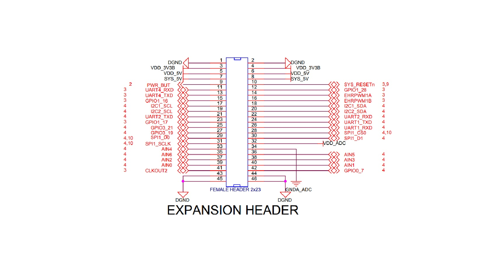
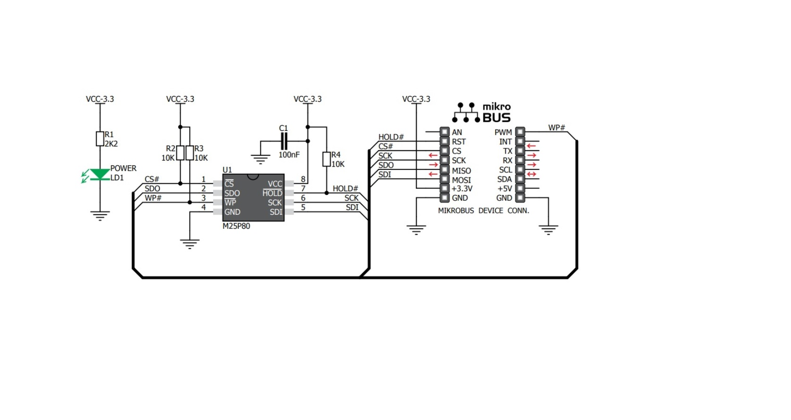

# MikroElektronika_CLICK_Design for BeagleBone Black

Open Source BeagleBone Black armv7 A8 platform reference and testing repository is created for MikroElektronika purposes.
Here, two examples how to use BeagleBone Black with MikroElektronica clicks are shown.

## Who is MikroElektronika?

https://www.mikroe.com/about

## What are the MikroElektronika products?

https://www.mikroe.com/

## BeagleBone Black HW, FW, SW Architectures

https://elinux.org/Beagleboard:BeagleBoneBlack

## BeagleBone Rev. C schematic (for download)

https://raw.githubusercontent.com/beagleboard/beaglebone-black/master/BBB_SCH.pdf

Schematic also could be found in local dir: Docs/BBB_SCH.pdf

## BeagleBone Expansion Header

## MikroElektronika mikroBUS design description

## [TODO] Connecting BBB Expansion Header and MikroE mikroBUS schematic

## [TODO] MikroBUS bridge device/gadget performing the phy connection

## Example 1: MikroElektronika ISP flash click schematic

https://download.mikroe.com/documents/add-on-boards/click/flash/flash-click-manual-v100.pdf

### [TODO] CLICK SPI Flash System and Application SW, showing the CLICK Referent Example

## Example 2: MikroElektronika I2C/ISP to serial I/F click schematic

https://media.digikey.com/pdf/Data%20Sheets/MikroElektronika%20PDFs/MIKROE-3349_Web.pdf

### [TODO] CLICK SPI/I2C to Serial Bridge System and Application SW, showing the CLICK Referent Design
